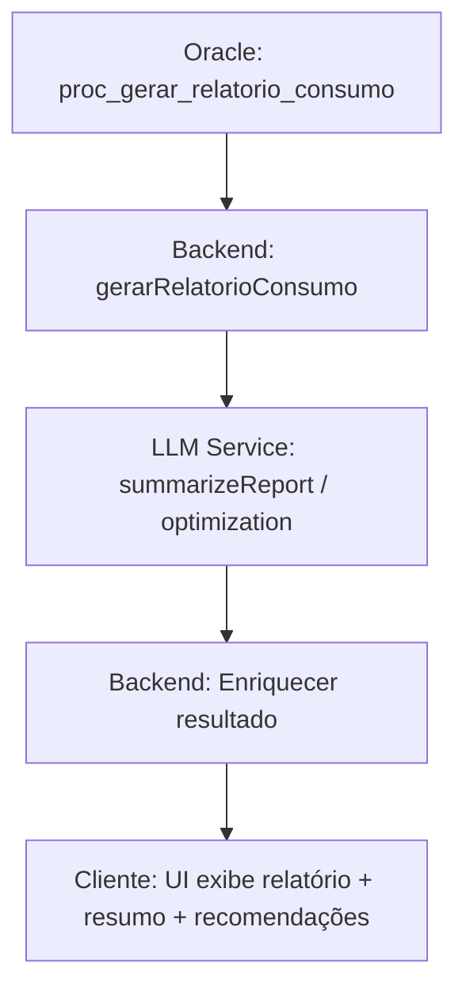
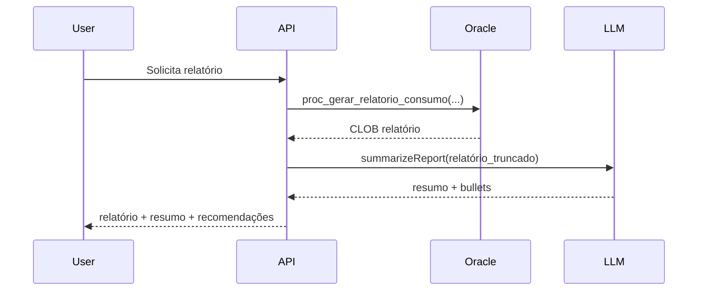

# Casos de Uso de IA e Impacto na Experiência do Usuário

Este documento descreve os casos de uso de IA já integrados ao backend (LLM), com ilustrações, fluxos e exemplos de interface centrados na experiência do usuário (UX).

## Sumário rápido
- Resumo executivo de relatórios (LLM)
- Otimização de consumo (recomendações acionáveis)
- Priorização de alertas (classificação e ações)
- Fluxos ilustrados, mocks de UI e recomendações de produto

---

## 1) Casos de uso implementados (visão resumida)

- Resumo Executivo de Relatórios
  - Endpoint: POST /api/v1/oracle/relatorio-llm/{userId}
  - Saída: resumo + 5 bullets de recomendações
  - Benefício: leitura imediata e foco em ações

- Otimização de Consumo
  - Serviço: generateConsumptionOptimization(report)
  - Saída: 6 recomendações acionáveis + 3 métricas para monitoramento
  - Benefício: direciona mudanças práticas; melhora aderência

- Priorização de Alertas
  - Serviço: generateAlertRecommendations(alertContext)
  - Saída: severidade, ações imediatas, ação de acompanhamento, indicação de notificar profissional
  - Benefício: reduz fadiga por alertas e melhora tomada de decisão

---

## 2) Fluxo de integração — diagrama



Observação: o backend é responsável por truncar e formatar o conteúdo antes do envio ao LLM (para custos e coerência), e por aplicar fallbacks quando necessário.

---

## 3) Jornada do usuário (exemplo)

1. Usuário solicita "Relatório de consumo semanal".
2. Backend gera relatório via procedure Oracle.
3. Backend chama LLM para gerar resumo e recomendações.
4. UI mostra: Relatório completo (expandir) + Cartão de Resumo (visível por padrão) + Ações sugeridas.

Mermaid de sequência:



---

## 4) Mockups e exemplos de UI

Card de Resumo (visível ao abrir relatório):
```
+----------------------------------------------------+
| Resumo Executivo (IA)                              |
| "Resumo curto em 3 linhas..."                      |
| - Recomendações:                                   |
|   1) Aumentar proteína no café da manhã            |
|   2) Reduzir snacks após 20:00                      |
|   3) Beber +200ml água ao acordar                   |
| [Ver Relatório Completo]  [Solicitar nova versão]  |
+----------------------------------------------------+
```

Exemplo de modal de alerta priorizado:
```
[ALERTA - HIGH] Baixa ingestão de calorias nos últimos 3 dias
Ações imediatas:
 - Ajustar lanche pós-treino (+150 kcal)
 - Se persistir, avaliar com nutricionista
[Abrir plano de ação]  [Marcar como resolvido]
```

---

## 5) Benefícios de produto e métricas a acompanhar

- Benefícios
  - Acelera compreensão: usuários entendem insights em segundos.
  - Aumenta engajamento: recomendações acionáveis aumentam retorno.
  - Reduz suporte: alerts priorizados diminuem tickets de baixo valor.

- Métricas recomendadas
  - Taxa de clique no "Ver Relatório Completo"
  - Taxa de adoção das recomendações sugeridas
  - Latência média da chamada LLM (ms)
  - Taxa de fallback (quando LLM não responde)

---

## 6) Gestão de disponibilidade e qualidade (operacional)

- Caching: armazenar resumo por hash do relatório para evitar chamadas repetidas.
- Circuit Breaker + Retry: impedir sobrecarga e reduzir erros cascata.
- Limite de tokens: truncamento controlado para manter custo previsível.
- Monitoramento: expor métricas (latência, erros, custo por chamada).

---

## 7) Boas práticas de prompts (exemplo)

Prompt modelo para resumo executivo:
> "Você é um assistente nutricional. Resuma o texto abaixo em até 150 palavras e liste 5 recomendações práticas. Texto: {relatorio_truncado}"

Prompt modelo para alertas:
> "Receba a lista de alertas abaixo. Para cada alerta, classifique severidade (CRITICAL/HIGH/MEDIUM/LOW), indique 2 ações imediatas e 1 ação de acompanhamento, e recomende se deve notificar um profissional."

---

## 8) Exemplos de uso na interface (pequenos cenários)

- Cenário A — Usuário ocupado:
  - Mostra apenas card IA com 3 bullets e botão "Aplicar sugestão". Resultado: maior probabilidade de ação rápida.

- Cenário B — Profissional de saúde:
  - Mostra relatório completo + seção "Sugestões da IA (revisar)". Profissional valida ou ajusta.

---

## 9) Roadmap de evolução (curto prazo)

- A/B test: apresentar resumo IA vs. resumo manual para medir efetividade.
- Feedback inline: permitir ao usuário marcar "útil / não útil" para treinar prompts e UX.
- Templates de prompt por contexto (ex.: diabéticos, atletas) para melhorar relevância.

---

## 10) Referência rápida — fallback behavior

- Se LLM indisponível: UI mostra relatório original e banner “Resumo gerado por IA indisponível no momento”.
- Campo retornado pelo backend: `llmError` com mensagem de status — UI deve exibir texto amigável.

---

Documento focado em experiência e ilustrações — removidas referências técnicas de privacidade conforme solicitado. Mantê‑lo vivo: atualizar com resultados dos testes A/B e métricas de adoção da IA.
