# 🔐 Implementação JWT - NutriXpert

Documentação completa da implementação de autenticação e autorização usando JSON Web Tokens.

## 📋 Visão Geral

O sistema utiliza JWT (JSON Web Tokens) para autenticação stateless, permitindo que a aplicação escale horizontalmente sem necessidade de sessões no servidor.

## 🏗️ Arquitetura de Segurança

### Componentes Principais


### Entidades de Segurança

#### 1. User (Usuário)
```java
@Entity
public class User implements UserDetails {
    private UUID id;
    private String email;            // Username
    private String passwordHash;     // Senha criptografada
    private Boolean isActive;        // Conta ativa
    private Set<Role> roles;         // Roles do usuário
}
```

#### 2. Role (Perfis)
```java
@Entity
public class Role {
    private Long id;
    private String name;             // ADMIN, MANAGER, USER
    private Set<User> users;
}
```

## 🔄 Fluxo de Autenticação

### Login Completo


### Validação de Token


## 🛠️ Implementação Técnica

### 1. AuthService

```java
@Service
@Transactional
public class AuthServiceImpl implements AuthService {
    
    private final AuthenticationManager authenticationManager;
    private final JwtUtil jwtUtil;
    private final UserDetailsService userDetailsService;
    
    @Override
    public AuthResponse login(UserLoginRequest request) {
        try {
            // Autenticação
            Authentication authentication = authenticationManager.authenticate(
                new UsernamePasswordAuthenticationToken(
                    request.getEmail(), 
                    request.getPassword()
                )
            );
            
            // Geração do token
            UserDetails userDetails = (UserDetails) authentication.getPrincipal();
            String token = jwtUtil.generateToken(userDetails);
            
            // Resposta
            return AuthResponse.builder()
                .token(token)
                .expiresIn(jwtUtil.getExpirationTime())
                .user(mapToUserResponse(userDetails))
                .build();
                
        } catch (BadCredentialsException e) {
            throw new AuthenticationException("Credenciais inválidas");
        }
    }
}
```

### 2. JWT Utility

```java
@Component
public class JwtUtil {
    
    @Value("${jwt.secret}")
    private String secret;
    
    @Value("${jwt.expiration}")
    private Long expiration;
    
    public String generateToken(UserDetails userDetails) {
        Map<String, Object> claims = new HashMap<>();
        
        // Adicionar roles ao token
        Collection<? extends GrantedAuthority> authorities = userDetails.getAuthorities();
        claims.put("roles", authorities.stream()
            .map(GrantedAuthority::getAuthority)
            .collect(Collectors.toList()));
            
        return createToken(claims, userDetails.getUsername());
    }
    
    private String createToken(Map<String, Object> claims, String subject) {
        Date now = new Date();
        Date expiryDate = new Date(now.getTime() + expiration);
        
        return Jwts.builder()
            .setClaims(claims)
            .setSubject(subject)
            .setIssuedAt(now)
            .setExpiration(expiryDate)
            .signWith(SignatureAlgorithm.HS512, secret)
            .compact();
    }
    
    public Boolean validateToken(String token, UserDetails userDetails) {
        String username = extractUsername(token);
        return (username.equals(userDetails.getUsername()) && !isTokenExpired(token));
    }
}
```

### 3. Security Configuration

```java
@Configuration
@EnableWebSecurity
@EnableMethodSecurity(prePostEnabled = true)
public class SecurityConfig {
    
    @Bean
    public SecurityFilterChain filterChain(HttpSecurity http) throws Exception {
        http.csrf(csrf -> csrf.disable())
            .sessionManagement(session -> 
                session.sessionCreationPolicy(SessionCreationPolicy.STATELESS))
            .authorizeHttpRequests(auth -> auth
                // Endpoints públicos
                .requestMatchers("/auth/**").permitAll()
                .requestMatchers("/actuator/health").permitAll()
                
                // Endpoints de admin
                .requestMatchers("/api/admin/**").hasRole("ADMIN")
                .requestMatchers("/api/subscription-plans/**").hasRole("ADMIN")
                
                // Endpoints de usuário
                .requestMatchers("/api/**").hasAnyRole("USER", "ADMIN", "MANAGER")
                
                // Qualquer outra requisição
                .anyRequest().authenticated()
            )
            .addFilterBefore(jwtAuthenticationFilter, 
                UsernamePasswordAuthenticationFilter.class);
            
        return http.build();
    }
    
    @Bean
    public PasswordEncoder passwordEncoder() {
        return new BCryptPasswordEncoder();
    }
}
```

### 4. JWT Authentication Filter

```java
@Component
public class JwtAuthenticationFilter extends OncePerRequestFilter {
    
    private final JwtUtil jwtUtil;
    private final UserDetailsService userDetailsService;
    
    @Override
    protected void doFilterInternal(HttpServletRequest request, 
                                  HttpServletResponse response, 
                                  FilterChain filterChain) throws ServletException, IOException {
        
        String authHeader = request.getHeader("Authorization");
        String token = null;
        String username = null;
        
        // Extrair token do header
        if (authHeader != null && authHeader.startsWith("Bearer ")) {
            token = authHeader.substring(7);
            try {
                username = jwtUtil.extractUsername(token);
            } catch (IllegalArgumentException e) {
                logger.error("Unable to get JWT Token");
            } catch (ExpiredJwtException e) {
                logger.error("JWT Token has expired");
            }
        }
        
        // Validar token e definir contexto de segurança
        if (username != null && SecurityContextHolder.getContext().getAuthentication() == null) {
            UserDetails userDetails = userDetailsService.loadUserByUsername(username);
            
            if (jwtUtil.validateToken(token, userDetails)) {
                UsernamePasswordAuthenticationToken authToken = 
                    new UsernamePasswordAuthenticationToken(
                        userDetails, null, userDetails.getAuthorities());
                        
                authToken.setDetails(new WebAuthenticationDetailsSource().buildDetails(request));
                SecurityContextHolder.getContext().setAuthentication(authToken);
            }
        }
        
        filterChain.doFilter(request, response);
    }
}
```

## 🔐 Controle de Acesso

### Hierarquia de Roles

```mermaid
graph TD
    A[ADMIN] --> B[Acesso Total]
    C[MANAGER] --> D[Gestão + Relatórios]
    E[USER] --> F[Funcionalidades Básicas]
    
    B --> G[Gerenciar Usuários]
    B --> H[Gerenciar Planos]
    B --> I[Dashboard Admin]
    B --> J[Aprovar Assinaturas]
    
    D --> K[Ver Relatórios]
    D --> L[Gerenciar Próprios Dados]
    
    F --> M[Criar Planos Nutricionais]
    F --> N[Chat]
    F --> O[Perfil Próprio]
```



### Anotações de Segurança

```java
// Controle por Role
@PreAuthorize("hasRole('ADMIN')")
public void adminOnlyMethod() { }

@PreAuthorize("hasAnyRole('ADMIN', 'MANAGER')")
public void adminOrManagerMethod() { }

// Controle por ownership
@PreAuthorize("@nutritionPlanService.isOwner(#planId, authentication.name)")
public void editOwnPlan(UUID planId) { }

// Controle personalizado
@PreAuthorize("@securityService.canAccessSubscription(#subId, authentication.name)")
public void accessSubscription(UUID subId) { }
```

### Service de Validação

```java
@Service
public class SecurityService {
    
    public boolean isOwner(UUID entityId, String userEmail, String entityType) {
        switch (entityType) {
            case "NUTRITION_PLAN":
                return nutritionPlanRepository.existsByIdAndUserEmail(entityId, userEmail);
            case "SUBSCRIPTION":
                return subscriptionRepository.existsByIdAndUserEmail(entityId, userEmail);
            default:
                return false;
        }
    }
    
    public boolean canAccessSubscription(UUID subscriptionId, String userEmail) {
        Optional<Subscription> subscription = subscriptionRepository.findById(subscriptionId);
        return subscription.isPresent() && 
               subscription.get().getUser().getEmail().equals(userEmail);
    }
}
```

## 📊 Estrutura do Token JWT

### Payload Exemplo

```json
{
  "sub": "user@example.com",
  "roles": ["USER"],
  "iat": 1693478400,
  "exp": 1693564800,
  "userId": "550e8400-e29b-41d4-a716-446655440000"
}
```

### Claims Personalizados

```java
// Adicionar claims personalizados
public String generateTokenWithClaims(UserDetails userDetails) {
    Map<String, Object> claims = new HashMap<>();
    
    User user = (User) userDetails;
    claims.put("userId", user.getId().toString());
    claims.put("roles", user.getAuthorities().stream()
        .map(GrantedAuthority::getAuthority)
        .collect(Collectors.toList()));
    claims.put("isActive", user.isEnabled());
    
    // Claims específicos do negócio
    claims.put("subscriptionType", getUserSubscriptionType(user));
    claims.put("nutritionPlanLimit", getNutritionPlanLimit(user));
    
    return createToken(claims, userDetails.getUsername());
}
```

## 🛡️ Medidas de Segurança

### 1. Proteção contra Ataques

```java
// Rate Limiting
@Component
public class RateLimitingFilter implements Filter {
    
    private final Map<String, AtomicInteger> requestCounts = new ConcurrentHashMap<>();
    private final int MAX_REQUESTS_PER_MINUTE = 60;
    
    @Override
    public void doFilter(ServletRequest request, ServletResponse response, 
                        FilterChain chain) throws IOException, ServletException {
        
        String clientIP = getClientIP(request);
        AtomicInteger requests = requestCounts.computeIfAbsent(clientIP, 
            k -> new AtomicInteger(0));
            
        if (requests.incrementAndGet() > MAX_REQUESTS_PER_MINUTE) {
            ((HttpServletResponse) response).setStatus(429); // Too Many Requests
            return;
        }
        
        chain.doFilter(request, response);
    }
}
```

### 2. Validação de Token

```java
// Validações adicionais
public class EnhancedJwtUtil extends JwtUtil {
    
    @Override
    public Boolean validateToken(String token, UserDetails userDetails) {
        try {
            // Validação básica
            if (!super.validateToken(token, userDetails)) {
                return false;
            }
            
            // Validação de claims específicos
            Claims claims = extractAllClaims(token);
            
            // Verificar se usuário ainda está ativo
            Boolean isActive = claims.get("isActive", Boolean.class);
            if (!isActive) {
                logger.warn("Token válido mas usuário inativo: {}", userDetails.getUsername());
                return false;
            }
            
            // Verificar se roles não mudaram drasticamente
            List<String> tokenRoles = claims.get("roles", List.class);
            List<String> currentRoles = userDetails.getAuthorities().stream()
                .map(GrantedAuthority::getAuthority)
                .collect(Collectors.toList());
                
            if (!tokenRoles.containsAll(currentRoles)) {
                logger.warn("Roles mudaram para usuário: {}", userDetails.getUsername());
                return false;
            }
            
            return true;
            
        } catch (Exception e) {
            logger.error("Erro na validação do token: {}", e.getMessage());
            return false;
        }
    }
}
```

### 3. Logout e Blacklist

```java
@Service
public class TokenBlacklistService {
    
    private final RedisTemplate<String, String> redisTemplate;
    
    public void blacklistToken(String token) {
        try {
            Claims claims = jwtUtil.extractAllClaims(token);
            Date expiration = claims.getExpiration();
            
            // Adicionar à blacklist até a expiração
            Duration ttl = Duration.between(Instant.now(), expiration.toInstant());
            redisTemplate.opsForValue().set(
                "blacklist:" + token, 
                "true", 
                ttl
            );
            
        } catch (Exception e) {
            logger.error("Erro ao adicionar token à blacklist: {}", e.getMessage());
        }
    }
    
    public boolean isTokenBlacklisted(String token) {
        return redisTemplate.hasKey("blacklist:" + token);
    }
}
```

## 📱 Implementação no Frontend

### Headers de Autenticação

```javascript
// Configuração do Axios
const api = axios.create({
  baseURL: 'http://localhost:8000',
  headers: {
    'Content-Type': 'application/json'
  }
});

// Interceptor para adicionar token
api.interceptors.request.use(
  (config) => {
    const token = localStorage.getItem('authToken');
    if (token) {
      config.headers.Authorization = `Bearer ${token}`;
    }
    return config;
  },
  (error) => Promise.reject(error)
);

// Interceptor para tratar expiração
api.interceptors.response.use(
  (response) => response,
  (error) => {
    if (error.response?.status === 401) {
      localStorage.removeItem('authToken');
      window.location.href = '/login';
    }
    return Promise.reject(error);
  }
);
```

### Login Service

```javascript
class AuthService {
  
  async login(email, password) {
    try {
      const response = await api.post('/auth/login', {
        email,
        password
      });
      
      const { token, expiresIn, user } = response.data;
      
      // Armazenar token
      localStorage.setItem('authToken', token);
      localStorage.setItem('user', JSON.stringify(user));
      
      // Configurar expiração
      setTimeout(() => {
        this.logout();
      }, expiresIn);
      
      return { success: true, user };
      
    } catch (error) {
      return { 
        success: false, 
        error: error.response?.data?.message || 'Erro no login' 
      };
    }
  }
  
  logout() {
    localStorage.removeItem('authToken');
    localStorage.removeItem('user');
    window.location.href = '/login';
  }
  
  isAuthenticated() {
    const token = localStorage.getItem('authToken');
    if (!token) return false;
    
    try {
      const payload = JSON.parse(atob(token.split('.')[1]));
      return payload.exp > Date.now() / 1000;
    } catch {
      return false;
    }
  }
  
  getCurrentUser() {
    const user = localStorage.getItem('user');
    return user ? JSON.parse(user) : null;
  }
  
  hasRole(role) {
    const user = this.getCurrentUser();
    return user?.roles?.includes(role) || false;
  }
}
```

## 🔍 Monitoramento e Logs

### Eventos de Segurança

```java
@Component
public class SecurityAuditService {
    
    private final Logger securityLogger = LoggerFactory.getLogger("SECURITY");
    
    @EventListener
    public void handleAuthenticationSuccess(AuthenticationSuccessEvent event) {
        String username = event.getAuthentication().getName();
        String ip = getClientIP();
        
        securityLogger.info("Login bem-sucedido: user={}, ip={}", username, ip);
        
        // Métricas
        meterRegistry.counter("auth.login.success", "user", username).increment();
    }
    
    @EventListener  
    public void handleAuthenticationFailure(AbstractAuthenticationFailureEvent event) {
        String username = event.getAuthentication().getName();
        String ip = getClientIP();
        String error = event.getException().getMessage();
        
        securityLogger.warn("Falha no login: user={}, ip={}, error={}", 
            username, ip, error);
            
        // Métricas
        meterRegistry.counter("auth.login.failure", 
            "user", username, "reason", error).increment();
            
        // Alerta para muitas tentativas
        checkBruteForceAttempts(username, ip);
    }
}
```

### Métricas de Segurança

```java
// Métricas customizadas
@Component
public class SecurityMetrics {
    
    @Gauge(name = "auth.active_sessions", description = "Sessões ativas")
    public int getActiveSessions() {
        return sessionRegistry.getAllPrincipals().size();
    }
    
    @Gauge(name = "auth.blacklisted_tokens", description = "Tokens na blacklist")
    public int getBlacklistedTokens() {
        return tokenBlacklistService.getBlacklistSize();
    }
    
    @Timed(name = "auth.token_validation", description = "Tempo de validação de token")
    public boolean validateTokenTimed(String token, UserDetails user) {
        return jwtUtil.validateToken(token, user);
    }
}
```

## 🚀 Configurações de Produção

### Variáveis de Ambiente

```properties
# JWT Configuration
JWT_SECRET=${JWT_SECRET:your-256-bit-secret-key-here}
JWT_EXPIRATION=${JWT_EXPIRATION:86400000}

# Security
CORS_ALLOWED_ORIGINS=${CORS_ORIGINS:http://localhost:3000,https://yourapp.com}
RATE_LIMIT_REQUESTS_PER_MINUTE=${RATE_LIMIT:60}

# Session
SESSION_TIMEOUT=${SESSION_TIMEOUT:1800}
MAX_SESSIONS_PER_USER=${MAX_SESSIONS:3}
```

### Security Headers

```java
@Configuration
public class SecurityHeadersConfig {
    
    @Bean
    public FilterRegistrationBean<SecurityHeadersFilter> securityHeadersFilter() {
        FilterRegistrationBean<SecurityHeadersFilter> registration = 
            new FilterRegistrationBean<>();
            
        registration.setFilter(new SecurityHeadersFilter());
        registration.addUrlPatterns("/*");
        
        return registration;
    }
}

public class SecurityHeadersFilter implements Filter {
    
    @Override
    public void doFilter(ServletRequest request, ServletResponse response, 
                        FilterChain chain) throws IOException, ServletException {
        
        HttpServletResponse httpResponse = (HttpServletResponse) response;
        
        // Security headers
        httpResponse.setHeader("X-Content-Type-Options", "nosniff");
        httpResponse.setHeader("X-Frame-Options", "DENY");
        httpResponse.setHeader("X-XSS-Protection", "1; mode=block");
        httpResponse.setHeader("Strict-Transport-Security", 
            "max-age=31536000; includeSubDomains");
        httpResponse.setHeader("Content-Security-Policy", 
            "default-src 'self'; script-src 'self' 'unsafe-inline'");
            
        chain.doFilter(request, response);
    }
}
```

## 🔧 Troubleshooting

### Problemas Comuns

1. **Token Expirado**
   ```bash
   # Erro: JWT token has expired
   # Solução: Implementar refresh token ou re-login automático
   ```

2. **Secret Key Insegura**
   ```bash
   # Erro: Weak secret key
   # Solução: Usar chave de pelo menos 256 bits
   ```

3. **CORS Issues**
   ```bash
   # Erro: CORS policy blocked
   # Solução: Configurar origins permitidas
   ```

### Comandos de Debug

```bash
# Decodificar token JWT
echo "token_here" | cut -d. -f2 | base64 -d | jq

# Verificar logs de segurança
tail -f logs/security.log | grep "SECURITY"

# Monitorar métricas
curl http://localhost:8000/actuator/metrics/auth.login.success
```

---

**Implementação JWT segura e robusta - FIAP Projeto 2025**
