# 🏗️ Documentação Completa de Serviços e Regras de Negócio - NutriXpert

Esta documentação apresenta todos os serviços do sistema, suas regras de negócio e fluxogramas detalhados.

## 📋 Índice de Serviços

1. [AuthService - Autenticação e Autorização](#1-authservice)
2. [SubscriptionService - Gestão de Assinaturas](#2-subscriptionservice)
3. [SubscriptionPlanService - Gestão de Planos](#3-subscriptionplanservice)
4. [NutritionPlanService - Planos Nutricionais](#4-nutritionplanservice)
5. [ChatService - Sistema de Chat](#5-chatservice)
6. [AdminDashboardService - Dashboard Administrativo](#6-admindashboardservice)
7. [ServiceProviderService - Fornecedores](#7-serviceproviderservice)
8. [UserPhotoService - Fotos de Usuários](#8-userphotoservice)
9. [CurrentUserService - Contexto do Usuário](#9-currentuserservice)

---

## 1. AuthService

### 📝 Responsabilidades
- Autenticação de usuários
- Geração e validação de tokens JWT
- Gerenciamento de sessões
- Validação de credenciais

### 🔄 Fluxograma: Processo de Login

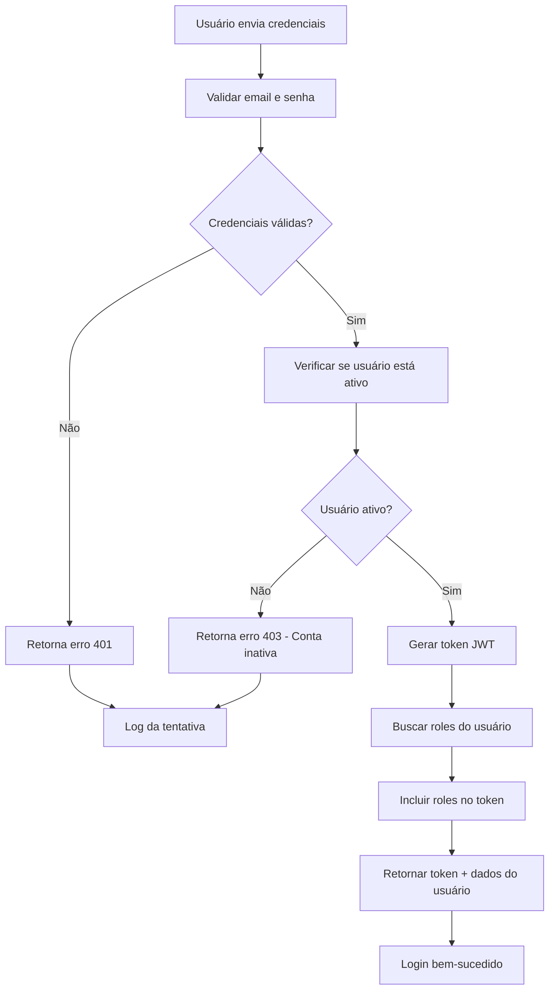

### 🛡️ Regras de Negócio

1. **Validação de Credenciais**
   - Email deve existir no sistema
   - Senha deve corresponder ao hash armazenado
   - Usuário deve estar ativo (`isActive = true`)

2. **Geração de Token JWT**
   - Token expira em 24 horas
   - Inclui roles e permissions do usuário
   - Assinado com chave secreta configurável

3. **Controle de Acesso**
   - ADMIN: Acesso total ao sistema
   - MANAGER: Gestão de usuários e relatórios
   - USER: Acesso às funcionalidades básicas

### 📊 APIs Principais

```java
// Login
POST /auth/login
{
  "email": "user@example.com",
  "password": "password123"
}

// Resposta
{
  "token": "eyJhbGciOiJIUzI1NiIs...",
  "expiresIn": 86400000,
  "user": {
    "id": "uuid",
    "email": "user@example.com",
    "roles": ["USER"]
  }
}
```

---

## 2. SubscriptionService

### 📝 Responsabilidades
- Criação de assinaturas de planos
- Aprovação/rejeição por administradores
- Cancelamento de assinaturas
- Regra de um plano ativo por usuário

### 🔄 Fluxograma: Criação de Assinatura

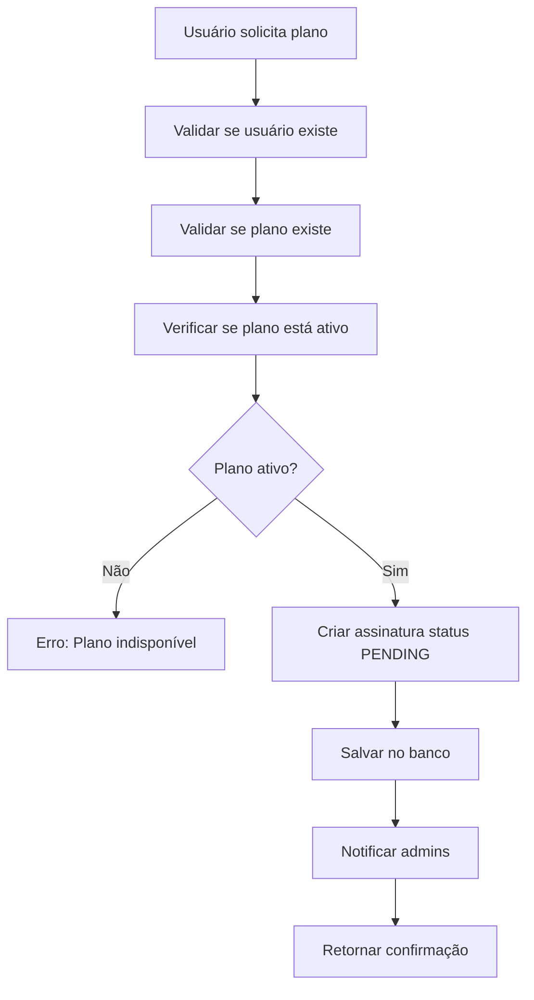

### 🔄 Fluxograma: Aprovação de Assinatura

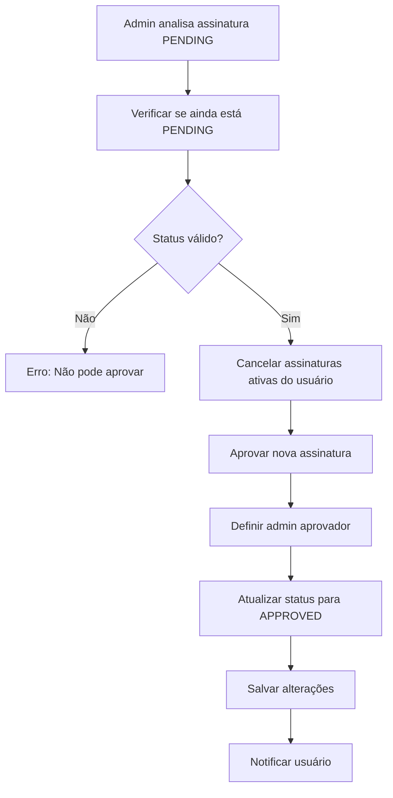

### 🛡️ Regras de Negócio Críticas

1. **Um Plano Ativo por Usuário**
   ```java
   // Antes de aprovar nova assinatura
   private void cancelActiveSubscriptionsForUser(UUID userId) {
       List<Subscription> activeSubscriptions = 
           subscriptionRepository.findActiveSubscriptionsByUserId(userId);
       
       activeSubscriptions.forEach(subscription -> {
           subscription.cancel();
           subscriptionRepository.save(subscription);
       });
   }
   ```

2. **Estados da Assinatura**
   - **PENDING**: Aguardando aprovação admin
   - **APPROVED**: Ativa e funcionando
   - **REJECTED**: Rejeitada pelo admin
   - **CANCELLED**: Cancelada pelo usuário/admin

3. **Validações de Negócio**
   - Só admins podem aprovar/rejeitar
   - Usuários só podem cancelar suas próprias assinaturas
   - Apenas assinaturas APPROVED podem ser canceladas
   - Apenas assinaturas PENDING podem ser aprovadas/rejeitadas

---

## 3. SubscriptionPlanService

### 📝 Responsabilidades
- CRUD de planos de assinatura
- Ativação/desativação de planos
- Validação de unicidade de nomes
- Controle de limites nutricionais

### 🔄 Fluxograma: Criação de Plano

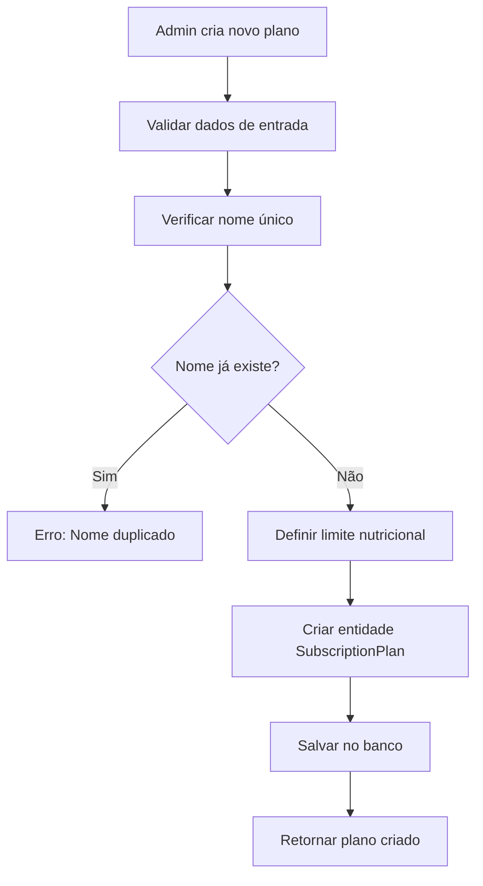

### 🛡️ Regras de Negócio

1. **Tipos de Planos e Limites**
   ```java
   // Limites por tipo de plano
   FREE: 5 planos nutricionais
   BASIC: 10 planos nutricionais  
   STANDARD: 20 planos nutricionais
   PREMIUM: null (ilimitado)
   ENTERPRISE: null (ilimitado)
   ```

2. **Validações**
   - Nome do plano deve ser único
   - Preço deve ser positivo
   - Apenas admins podem gerenciar planos

---

## 4. NutritionPlanService

### 📝 Responsabilidades
- Criação de planos nutricionais diários
- Validação de limites por tipo de assinatura
- Gerenciamento de refeições
- Cálculo de valores nutricionais

### 🔄 Fluxograma: Criação de Plano Nutricional

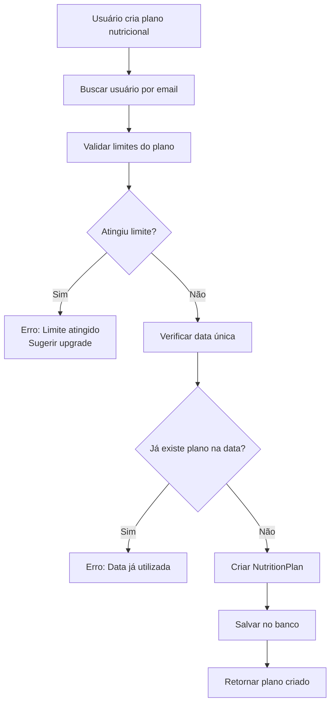

### 🔄 Fluxograma: Validação de Limites

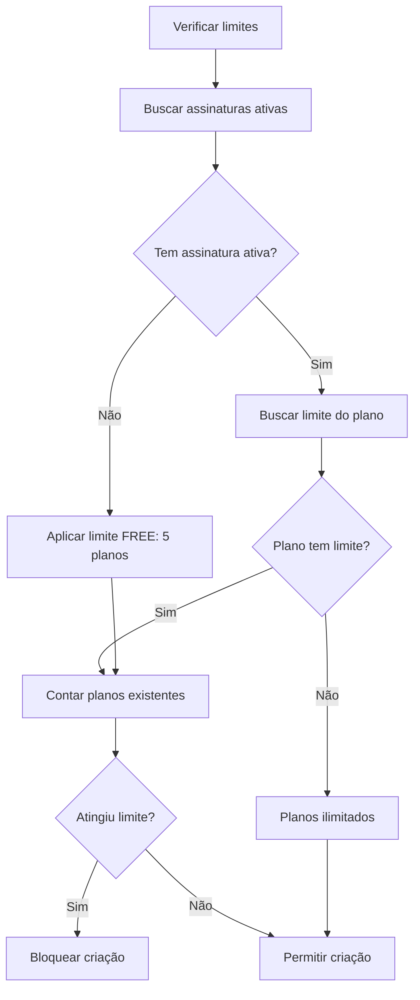

### 🛡️ Regras de Negócio

1. **Limites por Assinatura**
   ```java
   private void validateNutritionPlanLimits(User user) {
       List<Subscription> activeSubscriptions = 
           subscriptionRepository.findActiveSubscriptionsByUserId(user.getId());
       
       Integer limit;
       if (activeSubscriptions.isEmpty()) {
           limit = 5; // FREE
       } else {
           limit = activeSubscriptions.get(0).getPlan().getNutritionPlansLimit();
       }
       
       if (limit != null) {
           long currentCount = nutritionPlanRepository.countByUser(user);
           if (currentCount >= limit) {
               throw new PlanLimitExceededException();
           }
       }
   }
   ```

2. **Estrutura de Refeições**
   - Café da manhã (breakfast)
   - Lanche da manhã (morningSnack)
   - Almoço (lunch)  
   - Lanche da tarde (afternoonSnack)
   - Jantar (dinner)
   - Ceia (eveningSnack)

3. **Cálculos Nutricionais**
   - Calorias totais = soma de todas as refeições
   - Proteínas, carboidratos e gorduras por refeição
   - Controle de ingestão de água

---

## 5. ChatService

### 📝 Responsabilidades
- Processamento de mensagens
- Histórico de conversas
- Preparação para integração com IA
- Suporte multi-sessão

### 🔄 Fluxograma: Envio de Mensagem

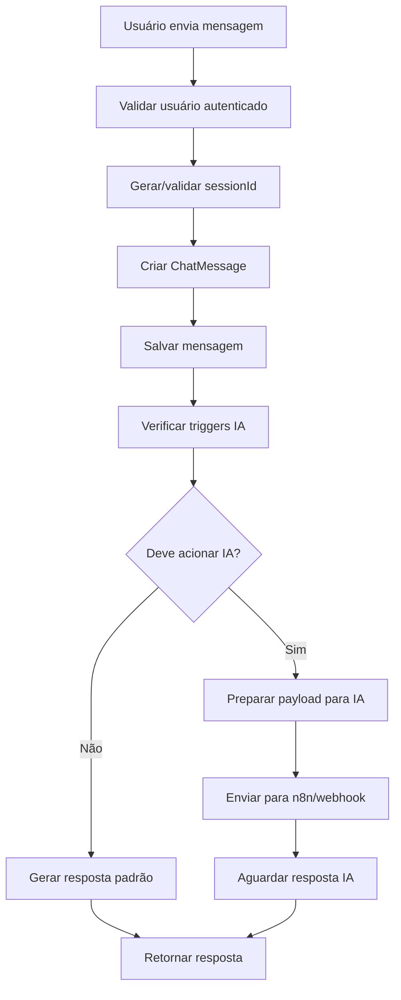

### 🔄 Fluxograma: Preparação para IA

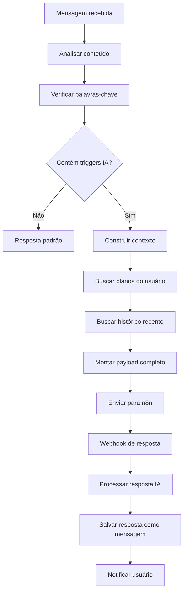

### 🛡️ Regras de Negócio

1. **Triggers para IA**
   ```java
   List<String> aiTriggers = Arrays.asList(
       "nutrição", "dieta", "calorias", "peso", "exercício",
       "receita", "ingrediente", "vitamina", "proteína"
   );
   ```

2. **Contexto para IA**
   - Mensagem atual do usuário
   - Histórico de 5 mensagens anteriores
   - Planos nutricionais ativos
   - Perfil do usuário (peso, altura, objetivos)

3. **Limitações**
   - Máximo 1000 caracteres por mensagem
   - Rate limit: 10 mensagens por minuto
   - Histórico mantido por 30 dias

---

## 6. AdminDashboardService

### 📝 Responsabilidades
- Geração de métricas administrativas
- Relatórios de uso do sistema
- KPIs de negócio
- Análises de crescimento

### 🔄 Fluxograma: Geração de Dashboard

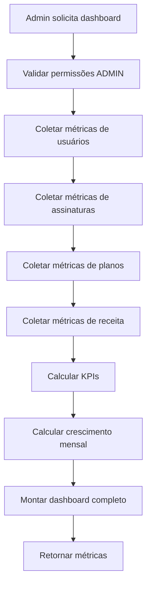

### 📊 Métricas Calculadas

1. **Métricas de Usuários**
   ```java
   - Total de usuários
   - Usuários ativos
   - Novos usuários (mês atual)
   - Taxa de crescimento mensal
   ```

2. **Métricas de Assinaturas**
   ```java
   - Total de assinaturas
   - Assinaturas ativas
   - Assinaturas pendentes
   - Taxa de conversão (FREE → PAID)
   ```

3. **Métricas Financeiras**
   ```java
   - Receita mensal recorrente (MRR)
   - Receita total
   - ARPU (Average Revenue Per User)
   - Churn rate
   ```

---

## 7. ServiceProviderService

### 📝 Responsabilidades
- Gestão de supermercados e fornecedores
- CRUD restrito a administradores
- Validação de dados de localização
- Controle de status ativo/inativo

### 🔄 Fluxograma: Cadastro de Fornecedor

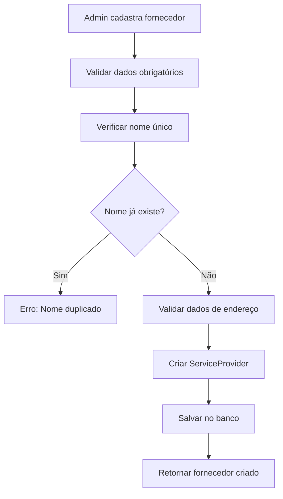

### 🛡️ Regras de Negócio

1. **Validações**
   - Nome deve ser único
   - Tipo deve ser válido (SUPERMARKET, RESTAURANT, etc.)
   - Endereço completo obrigatório
   - Telefone e email válidos

2. **Controle de Acesso**
   - Apenas admins podem gerenciar fornecedores
   - Usuários só podem visualizar fornecedores ativos

---

## 8. UserPhotoService

### 📝 Responsabilidades
- Upload de fotos de perfil
- Validação de formatos e tamanhos
- Controle de permissões de acesso
- Limpeza de arquivos órfãos

### 🔄 Fluxograma: Upload de Foto

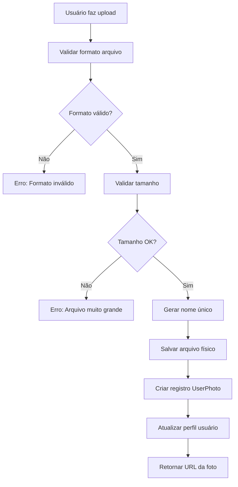

### 🛡️ Regras de Negócio

1. **Validações de Arquivo**
   - Formatos aceitos: JPG, PNG, GIF
   - Tamanho máximo: 5MB
   - Dimensões mínimas: 100x100px

2. **Segurança**
   - Usuários só podem gerenciar suas próprias fotos
   - Arquivos salvos fora do diretório web
   - Validação de content-type

---

## 9. CurrentUserService

### 📝 Responsabilidades
- Contexto do usuário autenticado
- Informações de plano atual
- Validação de permissões
- Cache de dados do usuário

### 🔄 Fluxograma: Obter Contexto do Usuário

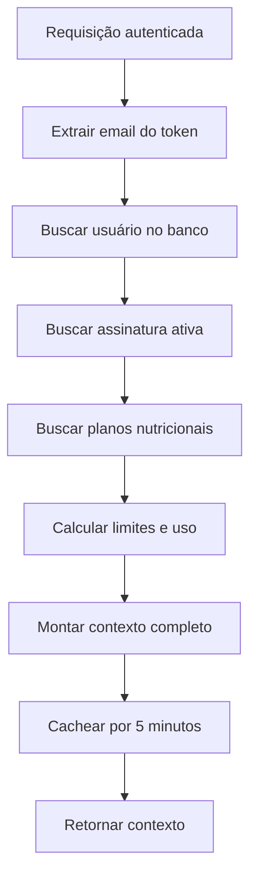

---

## 🔄 Fluxogramas de Processos Críticos

### Processo Completo: Do Cadastro ao Plano Nutricional

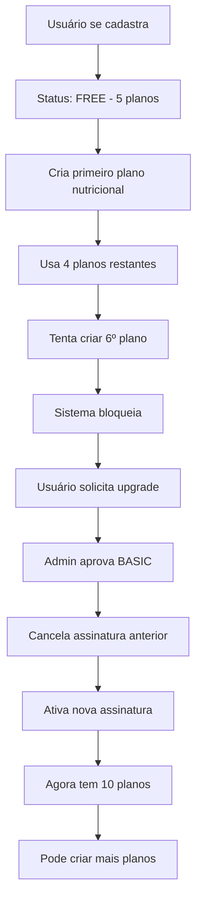

### Processo de Aprovação de Assinatura

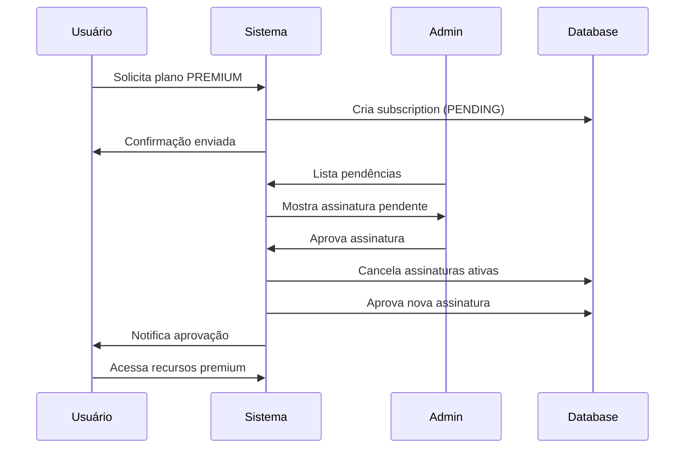

---

## 🚨 Regras de Negócio Críticas

### 1. Regra do Plano Único
```java
// Um usuário só pode ter UMA assinatura ativa por vez
@Transactional
public void approveSubscription(UUID subscriptionId, UUID adminId) {
    // 1. Cancela todas assinaturas ativas
    cancelActiveSubscriptionsForUser(userId);
    
    // 2. Ativa a nova assinatura
    subscription.approve(adminId);
}
```

### 3. Limites Dinâmicos
```java
// Limites se ajustam automaticamente ao plano do usuário
private Integer getUserNutritionPlanLimit(User user) {
    return subscriptionRepository.findActiveSubscriptionsByUserId(user.getId())
        .stream()
        .findFirst()
        .map(sub -> sub.getPlan().getNutritionPlansLimit())
        .orElse(5); // FREE default
}
```

### 3. Validação de Permissões
```java
// Diferentes níveis de acesso
@PreAuthorize("hasRole('ADMIN')")
public void manageSubscriptionPlans() { }

@PreAuthorize("hasRole('ADMIN') or hasRole('MANAGER')")  
public void viewDashboard() { }

@PreAuthorize("@nutritionPlanService.isOwner(#planId, authentication.name)")
public void editNutritionPlan(UUID planId) { }
```

---

## 📊 Monitoramento e Métricas

### KPIs por Serviço

1. **AuthService**
   - Taxa de login bem-sucedido
   - Tentativas de login inválidas
   - Tokens expirados

2. **SubscriptionService**
   - Taxa de conversão FREE → PAID
   - Tempo médio de aprovação
   - Taxa de cancelamento (churn)

3. **NutritionPlanService**
   - Planos criados por dia/mês
   - Utilização de limite por tipo de plano
   - Taxa de abandono

4. **ChatService**
   - Mensagens por usuário
   - Taxa de resposta da IA
   - Sessões ativas

---

## 🔍 Logs e Auditoria

### Eventos Auditados

```java
// Eventos críticos que geram logs
- Criação/aprovação/cancelamento de assinaturas
- Criação de planos nutricionais
- Mudanças de permissões
- Uploads de arquivos
- Tentativas de acesso negado
- Erros de sistema
```

### Formato de Log

```json
{
  "timestamp": "2025-08-31T14:30:00Z",
  "service": "SubscriptionService",
  "action": "APPROVE_SUBSCRIPTION",
  "userId": "uuid",
  "adminId": "uuid", 
  "subscriptionId": "uuid",
  "previousStatus": "PENDING",
  "newStatus": "APPROVED",
  "success": true
}
```

---

## 🎯 Próximas Evoluções

### Serviços Planejados

1. **NotificationService** - Notificações push e email
2. **ReportService** - Relatórios personalizados
3. **IntegrationService** - APIs externas
4. **AnalyticsService** - Análise comportamental
5. **PaymentService** - Gateway de pagamentos

### Melhorias Técnicas

- Cache distribuído (Redis)
- Processamento assíncrono (RabbitMQ)
- Circuit breakers
- Rate limiting avançado
- Monitoramento com Prometheus

---

**Documentação técnica completa - FIAP Projeto 2025**
