# 📋 Sistema de Planos de Assinatura - NutriXpert

Documentação completa do sistema de planos de assinatura e gerenciamento de subscrições.

## 📋 Visão Geral

O sistema de assinaturas do NutriXpert permite aos usuários escolher entre diferentes planos, cada um com benefícios específicos relacionados ao número de planos nutricionais que podem criar.

## 🏗️ Arquitetura do Sistema

```mermaid
graph TD
    A[Cliente] --> B[SubscriptionController]
    B --> C[SubscriptionService]
    C --> D[SubscriptionPlanService]
    D --> E[Database]
    C --> F[CurrentUserService]
    F --> G[JWT Token]
    
    H[AdminController] --> I[AdminDashboardService]
    I --> C
    I --> J[Métricas/Relatórios]
```



## 📊 Estrutura de Dados

### Entidades Principais

#### 1. SubscriptionPlan (Plano de Assinatura)
```java
@Entity
public class SubscriptionPlan {
    private UUID id;
    private String name;                    // Nome do plano
    private String description;             // Descrição detalhada
    private BigDecimal price;              // Preço mensal
    private Integer nutritionPlanLimit;     // Limite de planos nutricionais
    private Boolean isActive;              // Plano ativo/inativo
    private LocalDateTime createdAt;
    private LocalDateTime updatedAt;
}
```

#### 2. Subscription (Assinatura do Usuário)
```java
@Entity
public class Subscription {
    private UUID id;
    private User user;                     // Usuário assinante
    private SubscriptionPlan plan;         // Plano escolhido
    private SubscriptionStatus status;     // Status da assinatura
    private LocalDateTime startDate;       // Data de início
    private LocalDateTime endDate;         // Data de fim
    private LocalDateTime createdAt;
    private LocalDateTime updatedAt;
}
```

#### 3. SubscriptionStatus (Enum)
```java
public enum SubscriptionStatus {
    PENDING,      // Aguardando aprovação
    ACTIVE,       // Ativa
    SUSPENDED,    // Suspensa
    CANCELLED,    // Cancelada
    EXPIRED       // Expirada
}
```

## 🔄 Fluxos de Negócio

### 1. Criação de Plano de Assinatura (Admin)


### 2. Assinatura de Plano (Usuário)

```mermaid
sequenceDiagram
    participant U as Usuário
    participant SC as SubscriptionController
    participant SS as SubscriptionService
    participant CUS as CurrentUserService
    participant DB as Database
    
    U->>SC: POST /api/subscriptions
    SC->>CUS: getCurrentUser()
    CUS-->>SC: User details
    
    SC->>SS: createSubscription(planId, user)
    
    SS->>SS: Verificar se usuário já tem assinatura ativa
    alt Já tem assinatura ativa
        SS-->>SC: BusinessException
        SC-->>U: 400 Bad Request
    else Sem assinatura ativa
        SS->>DB: save(subscription PENDING)
        DB-->>SS: Subscription saved
        SS-->>SC: SubscriptionResponse
        SC-->>U: 201 Created
    end
```



### 3. Aprovação de Assinatura (Admin)


### 4. Verificação de Limites


## 🛠️ Implementação dos Serviços

### 1. SubscriptionPlanService

```java
@Service
@Transactional
public class SubscriptionPlanService {
    
    private final SubscriptionPlanRepository repository;
    
    public SubscriptionPlanResponse createSubscriptionPlan(SubscriptionPlanRequest request) {
        validateSubscriptionPlanRequest(request);
        
        SubscriptionPlan plan = SubscriptionPlan.builder()
            .name(request.getName())
            .description(request.getDescription())
            .price(request.getPrice())
            .nutritionPlanLimit(request.getNutritionPlanLimit())
            .isActive(true)
            .createdAt(LocalDateTime.now())
            .build();
            
        SubscriptionPlan saved = repository.save(plan);
        return mapToResponse(saved);
    }
    
    public List<SubscriptionPlanResponse> getAllActivePlans() {
        return repository.findByIsActiveTrue()
            .stream()
            .map(this::mapToResponse)
            .collect(Collectors.toList());
    }
    
    public SubscriptionPlanResponse updateSubscriptionPlan(UUID id, SubscriptionPlanRequest request) {
        SubscriptionPlan plan = repository.findById(id)
            .orElseThrow(() -> new EntityNotFoundException("Plano não encontrado"));
            
        validateSubscriptionPlanRequest(request);
        
        plan.setName(request.getName());
        plan.setDescription(request.getDescription());
        plan.setPrice(request.getPrice());
        plan.setNutritionPlanLimit(request.getNutritionPlanLimit());
        plan.setUpdatedAt(LocalDateTime.now());
        
        SubscriptionPlan updated = repository.save(plan);
        return mapToResponse(updated);
    }
    
    private void validateSubscriptionPlanRequest(SubscriptionPlanRequest request) {
        if (request.getPrice().compareTo(BigDecimal.ZERO) < 0) {
            throw new ValidationException("Preço não pode ser negativo");
        }
        
        if (request.getNutritionPlanLimit() <= 0) {
            throw new ValidationException("Limite deve ser maior que zero");
        }
        
        // Verificar se já existe plano com mesmo nome
        boolean nameExists = repository.existsByNameAndIsActiveTrue(request.getName());
        if (nameExists) {
            throw new ValidationException("Já existe um plano ativo com este nome");
        }
    }
}
```

### 2. SubscriptionService

```java
@Service
@Transactional
public class SubscriptionService {
    
    private final SubscriptionRepository repository;
    private final SubscriptionPlanService planService;
    private final CurrentUserService currentUserService;
    
    public SubscriptionResponse createSubscription(SubscriptionRequest request) {
        User currentUser = currentUserService.getCurrentUser();
        
        // Verificar se usuário já tem assinatura ativa
        Optional<Subscription> activeSubscription = 
            repository.findByUserAndStatus(currentUser, SubscriptionStatus.ACTIVE);
            
        if (activeSubscription.isPresent()) {
            throw new BusinessException("Usuário já possui uma assinatura ativa");
        }
        
        // Buscar plano
        SubscriptionPlan plan = planService.findById(request.getSubscriptionPlanId());
        if (!plan.getIsActive()) {
            throw new BusinessException("Plano selecionado não está disponível");
        }
        
        // Criar assinatura pendente
        Subscription subscription = Subscription.builder()
            .user(currentUser)
            .plan(plan)
            .status(SubscriptionStatus.PENDING)
            .createdAt(LocalDateTime.now())
            .build();
            
        Subscription saved = repository.save(subscription);
        return mapToResponse(saved);
    }
    
    public SubscriptionResponse approveSubscription(UUID subscriptionId) {
        Subscription subscription = repository.findById(subscriptionId)
            .orElseThrow(() -> new EntityNotFoundException("Assinatura não encontrada"));
            
        if (subscription.getStatus() != SubscriptionStatus.PENDING) {
            throw new BusinessException("Apenas assinaturas pendentes podem ser aprovadas");
        }
        
        // Verificar se usuário já tem outra assinatura ativa
        Optional<Subscription> existingActive = repository
            .findByUserAndStatus(subscription.getUser(), SubscriptionStatus.ACTIVE);
            
        if (existingActive.isPresent()) {
            throw new BusinessException("Usuário já possui uma assinatura ativa");
        }
        
        // Aprovar assinatura
        subscription.setStatus(SubscriptionStatus.ACTIVE);
        subscription.setStartDate(LocalDateTime.now());
        subscription.setEndDate(LocalDateTime.now().plusDays(30)); // 30 dias
        subscription.setUpdatedAt(LocalDateTime.now());
        
        Subscription approved = repository.save(subscription);
        return mapToResponse(approved);
    }
    
    public SubscriptionResponse updateSubscriptionStatus(UUID id, SubscriptionStatusUpdateRequest request) {
        Subscription subscription = repository.findById(id)
            .orElseThrow(() -> new EntityNotFoundException("Assinatura não encontrada"));
            
        SubscriptionStatus newStatus = request.getStatus();
        SubscriptionStatus currentStatus = subscription.getStatus();
        
        // Validar transições de status
        validateStatusTransition(currentStatus, newStatus);
        
        subscription.setStatus(newStatus);
        subscription.setUpdatedAt(LocalDateTime.now());
        
        // Atualizar datas conforme status
        updateSubscriptionDates(subscription, newStatus);
        
        Subscription updated = repository.save(subscription);
        return mapToResponse(updated);
    }
    
    public Optional<Subscription> getCurrentUserActiveSubscription() {
        User currentUser = currentUserService.getCurrentUser();
        return repository.findByUserAndStatus(currentUser, SubscriptionStatus.ACTIVE);
    }
    
    public int getCurrentUserNutritionPlanLimit() {
        return getCurrentUserActiveSubscription()
            .map(sub -> sub.getPlan().getNutritionPlanLimit())
            .orElse(0); // Sem assinatura = 0 planos
    }
    
    private void validateStatusTransition(SubscriptionStatus current, SubscriptionStatus target) {
        Map<SubscriptionStatus, Set<SubscriptionStatus>> allowedTransitions = Map.of(
            SubscriptionStatus.PENDING, Set.of(SubscriptionStatus.ACTIVE, SubscriptionStatus.CANCELLED),
            SubscriptionStatus.ACTIVE, Set.of(SubscriptionStatus.SUSPENDED, SubscriptionStatus.CANCELLED),
            SubscriptionStatus.SUSPENDED, Set.of(SubscriptionStatus.ACTIVE, SubscriptionStatus.CANCELLED),
            SubscriptionStatus.CANCELLED, Set.of(), // Não pode sair de cancelado
            SubscriptionStatus.EXPIRED, Set.of() // Não pode sair de expirado
        );
        
        Set<SubscriptionStatus> allowed = allowedTransitions.get(current);
        if (!allowed.contains(target)) {
            throw new BusinessException(
                String.format("Transição de %s para %s não é permitida", current, target)
            );
        }
    }
    
    private void updateSubscriptionDates(Subscription subscription, SubscriptionStatus status) {
        switch (status) {
            case ACTIVE:
                if (subscription.getStartDate() == null) {
                    subscription.setStartDate(LocalDateTime.now());
                    subscription.setEndDate(LocalDateTime.now().plusDays(30));
                }
                break;
            case CANCELLED:
            case EXPIRED:
                if (subscription.getEndDate() == null || 
                    subscription.getEndDate().isAfter(LocalDateTime.now())) {
                    subscription.setEndDate(LocalDateTime.now());
                }
                break;
        }
    }
}
```

### 3. AdminDashboardService (Métricas de Assinaturas)

```java
@Service
public class AdminDashboardService {
    
    private final SubscriptionRepository subscriptionRepository;
    private final SubscriptionPlanRepository planRepository;
    
    public SubscriptionMetrics getSubscriptionMetrics() {
        // Contadores por status
        long totalSubscriptions = subscriptionRepository.count();
        long activeSubscriptions = subscriptionRepository.countByStatus(SubscriptionStatus.ACTIVE);
        long pendingSubscriptions = subscriptionRepository.countByStatus(SubscriptionStatus.PENDING);
        long cancelledSubscriptions = subscriptionRepository.countByStatus(SubscriptionStatus.CANCELLED);
        
        // Receita mensal estimada
        BigDecimal monthlyRevenue = subscriptionRepository
            .findActiveSubscriptionsWithPlans()
            .stream()
            .map(sub -> sub.getPlan().getPrice())
            .reduce(BigDecimal.ZERO, BigDecimal::add);
        
        // Plano mais popular
        Map<String, Long> subscriptionsByPlan = subscriptionRepository
            .findActiveSubscriptionsWithPlans()
            .stream()
            .collect(Collectors.groupingBy(
                sub -> sub.getPlan().getName(),
                Collectors.counting()
            ));
            
        String mostPopularPlan = subscriptionsByPlan.entrySet()
            .stream()
            .max(Map.Entry.comparingByValue())
            .map(Map.Entry::getKey)
            .orElse("Nenhum");
        
        // Assinaturas por mês (últimos 6 meses)
        List<MonthlySubscriptionData> monthlyData = getMonthlySubscriptionData();
        
        return SubscriptionMetrics.builder()
            .totalSubscriptions(totalSubscriptions)
            .activeSubscriptions(activeSubscriptions)
            .pendingSubscriptions(pendingSubscriptions)
            .cancelledSubscriptions(cancelledSubscriptions)
            .monthlyRevenue(monthlyRevenue)
            .mostPopularPlan(mostPopularPlan)
            .monthlyData(monthlyData)
            .build();
    }
    
    public List<SubscriptionResponse> getPendingSubscriptions() {
        return subscriptionRepository.findByStatusOrderByCreatedAtAsc(SubscriptionStatus.PENDING)
            .stream()
            .map(this::mapToResponse)
            .collect(Collectors.toList());
    }
    
    private List<MonthlySubscriptionData> getMonthlySubscriptionData() {
        LocalDateTime sixMonthsAgo = LocalDateTime.now().minusMonths(6);
        
        List<Object[]> rawData = subscriptionRepository
            .getSubscriptionCountByMonth(sixMonthsAgo);
            
        return rawData.stream()
            .map(row -> new MonthlySubscriptionData(
                ((Number) row[0]).intValue(), // year
                ((Number) row[1]).intValue(), // month  
                ((Number) row[2]).longValue()  // count
            ))
            .collect(Collectors.toList());
    }
}
```

## 📊 DTOs e Requests

### Requests

```java
// Criar plano de assinatura
@Data
@Builder
public class SubscriptionPlanRequest {
    @NotBlank(message = "Nome é obrigatório")
    @Size(min = 3, max = 100, message = "Nome deve ter entre 3 e 100 caracteres")
    private String name;
    
    @Size(max = 500, message = "Descrição deve ter no máximo 500 caracteres")
    private String description;
    
    @NotNull(message = "Preço é obrigatório")
    @DecimalMin(value = "0.0", inclusive = false, message = "Preço deve ser maior que zero")
    private BigDecimal price;
    
    @NotNull(message = "Limite de planos nutricionais é obrigatório")
    @Min(value = 1, message = "Limite deve ser pelo menos 1")
    @Max(value = 100, message = "Limite não pode exceder 100")
    private Integer nutritionPlanLimit;
}

// Criar assinatura
@Data
@Builder
public class SubscriptionRequest {
    @NotNull(message = "ID do plano é obrigatório")
    private UUID subscriptionPlanId;
}

// Atualizar status da assinatura
@Data
@Builder
public class SubscriptionStatusUpdateRequest {
    @NotNull(message = "Status é obrigatório")
    private SubscriptionStatus status;
    
    @Size(max = 200, message = "Motivo deve ter no máximo 200 caracteres")
    private String reason;
}
```

### Responses

```java
// Resposta do plano de assinatura
@Data
@Builder
public class SubscriptionPlanResponse {
    private UUID id;
    private String name;
    private String description;
    private BigDecimal price;
    private Integer nutritionPlanLimit;
    private Boolean isActive;
    private LocalDateTime createdAt;
    private LocalDateTime updatedAt;
}

// Resposta da assinatura
@Data
@Builder
public class SubscriptionResponse {
    private UUID id;
    private UserSummaryResponse user;
    private SubscriptionPlanResponse plan;
    private SubscriptionStatus status;
    private LocalDateTime startDate;
    private LocalDateTime endDate;
    private LocalDateTime createdAt;
    private LocalDateTime updatedAt;
    
    // Campos calculados
    private Boolean isActive;
    private Long daysRemaining;
    private Integer nutritionPlansUsed;
    private Integer nutritionPlansLimit;
}

// Métricas de assinaturas
@Data
@Builder
public class SubscriptionMetrics {
    private Long totalSubscriptions;
    private Long activeSubscriptions;
    private Long pendingSubscriptions;
    private Long cancelledSubscriptions;
    private BigDecimal monthlyRevenue;
    private String mostPopularPlan;
    private List<MonthlySubscriptionData> monthlyData;
}
```

## 🔒 Controle de Acesso

### Endpoints e Permissões

```java
// Endpoints públicos - visualizar planos
@GetMapping("/subscription-plans")
@PreAuthorize("permitAll()")
public ResponseEntity<List<SubscriptionPlanResponse>> getAllPlans()

// Endpoints de usuário - gerenciar próprias assinaturas  
@PostMapping("/subscriptions")
@PreAuthorize("hasRole('USER')")
public ResponseEntity<SubscriptionResponse> createSubscription()

@GetMapping("/subscriptions/my")
@PreAuthorize("hasRole('USER')")
public ResponseEntity<SubscriptionResponse> getMySubscription()

// Endpoints de admin - gerenciar tudo
@PostMapping("/admin/subscription-plans")
@PreAuthorize("hasRole('ADMIN')")
public ResponseEntity<SubscriptionPlanResponse> createPlan()

@PutMapping("/admin/subscriptions/{id}/approve")
@PreAuthorize("hasRole('ADMIN')")
public ResponseEntity<SubscriptionResponse> approveSubscription()

@GetMapping("/admin/subscriptions/pending")
@PreAuthorize("hasRole('ADMIN')")
public ResponseEntity<List<SubscriptionResponse>> getPendingSubscriptions()
```

### Validação de Ownership

```java
@Service
public class SubscriptionSecurityService {
    
    @PreAuthorize("@subscriptionSecurityService.canAccessSubscription(#subscriptionId, authentication.name)")
    public SubscriptionResponse getSubscription(UUID subscriptionId) {
        // Implementação do método
    }
    
    public boolean canAccessSubscription(UUID subscriptionId, String userEmail) {
        return subscriptionRepository
            .findById(subscriptionId)
            .map(subscription -> subscription.getUser().getEmail().equals(userEmail))
            .orElse(false);
    }
}
```

## 📈 Regras de Negócio

### 1. Regra da Assinatura Única Ativa

```java
// Apenas uma assinatura ativa por usuário
public void validateSingleActiveSubscription(User user) {
    long activeCount = subscriptionRepository
        .countByUserAndStatus(user, SubscriptionStatus.ACTIVE);
        
    if (activeCount > 0) {
        throw new BusinessException(
            "Usuário já possui uma assinatura ativa. " +
            "Cancele a assinatura atual antes de criar uma nova."
        );
    }
}
```

### 2. Controle de Limites de Planos Nutricionais

```java
// Verificar limite antes de criar plano nutricional
public void validateNutritionPlanLimit(User user) {
    Optional<Subscription> activeSubscription = 
        subscriptionRepository.findByUserAndStatus(user, SubscriptionStatus.ACTIVE);
        
    if (activeSubscription.isEmpty()) {
        throw new BusinessException("Usuário deve ter uma assinatura ativa para criar planos nutricionais");
    }
    
    int limit = activeSubscription.get().getPlan().getNutritionPlanLimit();
    long currentCount = nutritionPlanRepository.countByUser(user);
    
    if (currentCount >= limit) {
        throw new LimitExceededException(
            String.format("Limite de %d planos nutricionais atingido para sua assinatura", limit)
        );
    }
}
```

### 3. Transições de Status Válidas

```java
// Matriz de transições permitidas
private static final Map<SubscriptionStatus, Set<SubscriptionStatus>> ALLOWED_TRANSITIONS = Map.of(
    PENDING, Set.of(ACTIVE, CANCELLED),
    ACTIVE, Set.of(SUSPENDED, CANCELLED, EXPIRED),
    SUSPENDED, Set.of(ACTIVE, CANCELLED),
    CANCELLED, Set.of(), // Estado final
    EXPIRED, Set.of()    // Estado final
);

public void validateStatusTransition(SubscriptionStatus from, SubscriptionStatus to) {
    if (!ALLOWED_TRANSITIONS.get(from).contains(to)) {
        throw new InvalidStatusTransitionException(
            String.format("Não é possível alterar status de %s para %s", from, to)
        );
    }
}
```

### 4. Políticas de Preço

```java
// Validações de preço para planos
public void validatePlanPricing(SubscriptionPlanRequest request) {
    BigDecimal price = request.getPrice();
    Integer limit = request.getNutritionPlanLimit();
    
    // Preço mínimo baseado no limite
    BigDecimal minimumPrice = BigDecimal.valueOf(limit * 5.0); // R$ 5 por plano
    
    if (price.compareTo(minimumPrice) < 0) {
        throw new ValidationException(
            String.format("Preço mínimo para %d planos é R$ %.2f", limit, minimumPrice)
        );
    }
    
    // Preço máximo
    BigDecimal maximumPrice = BigDecimal.valueOf(500.0);
    if (price.compareTo(maximumPrice) > 0) {
        throw new ValidationException("Preço não pode exceder R$ 500,00");
    }
}
```

## 🚀 Jobs Automatizados

### Expiração de Assinaturas

```java
@Component
public class SubscriptionExpirationJob {
    
    @Scheduled(cron = "0 0 2 * * ?") // Todo dia às 2h
    public void expireSubscriptions() {
        LocalDateTime now = LocalDateTime.now();
        
        List<Subscription> expiredSubscriptions = subscriptionRepository
            .findActiveSubscriptionsExpiredBefore(now);
            
        for (Subscription subscription : expiredSubscriptions) {
            subscription.setStatus(SubscriptionStatus.EXPIRED);
            subscription.setUpdatedAt(now);
            
            subscriptionRepository.save(subscription);
            
            // Notificar usuário
            notificationService.sendExpirationNotification(subscription.getUser());
            
            log.info("Assinatura expirada: userId={}, subscriptionId={}", 
                subscription.getUser().getId(), subscription.getId());
        }
        
        log.info("Processadas {} assinaturas expiradas", expiredSubscriptions.size());
    }
}
```

### Lembrete de Renovação

```java
@Component  
public class SubscriptionReminderJob {
    
    @Scheduled(cron = "0 0 10 * * ?") // Todo dia às 10h
    public void sendRenewalReminders() {
        LocalDateTime threeDaysFromNow = LocalDateTime.now().plusDays(3);
        
        List<Subscription> expiringSubscriptions = subscriptionRepository
            .findActiveSubscriptionsExpiringBefore(threeDaysFromNow);
            
        for (Subscription subscription : expiringSubscriptions) {
            // Verificar se já foi enviado lembrete
            if (!reminderService.wasReminderSent(subscription)) {
                notificationService.sendRenewalReminder(subscription.getUser(), subscription);
                reminderService.markReminderSent(subscription);
                
                log.info("Lembrete de renovação enviado: userId={}, subscriptionId={}", 
                    subscription.getUser().getId(), subscription.getId());
            }
        }
    }
}
```

## 📊 Relatórios e Métricas

### Dashboard de Administração

```java
// Métricas em tempo real
@GetMapping("/admin/dashboard/subscription-metrics")
public ResponseEntity<SubscriptionDashboard> getSubscriptionMetrics() {
    
    // Estatísticas gerais
    long totalSubscriptions = subscriptionRepository.count();
    long activeSubscriptions = subscriptionRepository.countByStatus(ACTIVE);
    long pendingApproval = subscriptionRepository.countByStatus(PENDING);
    
    // Receita mensal
    BigDecimal monthlyRevenue = calculateMonthlyRevenue();
    
    // Taxa de conversão (aprovadas / criadas no mês)
    double conversionRate = calculateMonthlyConversionRate();
    
    // Churn rate (canceladas no mês / ativas no início do mês)
    double churnRate = calculateMonthlyChurnRate();
    
    // Distribuição por planos
    Map<String, Long> planDistribution = getActivePlanDistribution();
    
    return ResponseEntity.ok(SubscriptionDashboard.builder()
        .totalSubscriptions(totalSubscriptions)
        .activeSubscriptions(activeSubscriptions)
        .pendingApproval(pendingApproval)
        .monthlyRevenue(monthlyRevenue)
        .conversionRate(conversionRate)
        .churnRate(churnRate)
        .planDistribution(planDistribution)
        .build());
}
```

### Relatório de Receita

```java
// Relatório detalhado de receita
@GetMapping("/admin/reports/revenue")
public ResponseEntity<RevenueReport> getRevenueReport(
        @RequestParam @DateTimeFormat(iso = DateTimeFormat.ISO.DATE) LocalDate startDate,
        @RequestParam @DateTimeFormat(iso = DateTimeFormat.ISO.DATE) LocalDate endDate) {
    
    // Receita por período
    List<DailyRevenue> dailyRevenue = subscriptionRepository
        .getDailyRevenue(startDate.atStartOfDay(), endDate.atTime(23, 59, 59));
    
    // Receita por plano
    Map<String, BigDecimal> revenueByPlan = subscriptionRepository
        .getRevenueByPlan(startDate.atStartOfDay(), endDate.atTime(23, 59, 59));
    
    // Projeções
    BigDecimal totalRevenue = dailyRevenue.stream()
        .map(DailyRevenue::getAmount)
        .reduce(BigDecimal.ZERO, BigDecimal::add);
    
    return ResponseEntity.ok(RevenueReport.builder()
        .period(new DatePeriod(startDate, endDate))
        .totalRevenue(totalRevenue)
        .dailyRevenue(dailyRevenue)
        .revenueByPlan(revenueByPlan)
        .build());
}
```

## 🔍 Auditoria e Logs

### Log de Mudanças de Status

```java
@Entity
@Table(name = "subscription_audit")
public class SubscriptionAudit {
    private UUID id;
    private UUID subscriptionId;
    private SubscriptionStatus previousStatus;
    private SubscriptionStatus newStatus;
    private String changedBy;
    private String reason;
    private LocalDateTime changedAt;
}

@Component
public class SubscriptionAuditService {
    
    @EventListener
    public void handleStatusChange(SubscriptionStatusChangedEvent event) {
        SubscriptionAudit audit = SubscriptionAudit.builder()
            .subscriptionId(event.getSubscriptionId())
            .previousStatus(event.getPreviousStatus())
            .newStatus(event.getNewStatus())
            .changedBy(event.getChangedBy())
            .reason(event.getReason())
            .changedAt(LocalDateTime.now())
            .build();
            
        subscriptionAuditRepository.save(audit);
        
        log.info("Status da assinatura alterado: subscriptionId={}, {} -> {}, by={}", 
            event.getSubscriptionId(), 
            event.getPreviousStatus(), 
            event.getNewStatus(),
            event.getChangedBy());
    }
}
```

## 🧪 Testes

### Testes de Unidade

```java
@ExtendWith(MockitoExtension.class)
class SubscriptionServiceTest {
    
    @Mock
    private SubscriptionRepository subscriptionRepository;
    
    @Mock
    private CurrentUserService currentUserService;
    
    @InjectMocks
    private SubscriptionService subscriptionService;
    
    @Test
    void shouldCreateSubscriptionWhenUserHasNoActiveSubscription() {
        // Given
        User user = createTestUser();
        SubscriptionPlan plan = createTestPlan();
        SubscriptionRequest request = SubscriptionRequest.builder()
            .subscriptionPlanId(plan.getId())
            .build();
            
        when(currentUserService.getCurrentUser()).thenReturn(user);
        when(subscriptionRepository.findByUserAndStatus(user, ACTIVE))
            .thenReturn(Optional.empty());
        when(subscriptionPlanService.findById(plan.getId())).thenReturn(plan);
        
        // When
        SubscriptionResponse response = subscriptionService.createSubscription(request);
        
        // Then
        assertThat(response.getStatus()).isEqualTo(PENDING);
        verify(subscriptionRepository).save(any(Subscription.class));
    }
    
    @Test
    void shouldThrowExceptionWhenUserAlreadyHasActiveSubscription() {
        // Given
        User user = createTestUser();
        Subscription existingSubscription = createActiveSubscription(user);
        SubscriptionRequest request = SubscriptionRequest.builder()
            .subscriptionPlanId(UUID.randomUUID())
            .build();
            
        when(currentUserService.getCurrentUser()).thenReturn(user);
        when(subscriptionRepository.findByUserAndStatus(user, ACTIVE))
            .thenReturn(Optional.of(existingSubscription));
        
        // When & Then
        assertThatThrownBy(() -> subscriptionService.createSubscription(request))
            .isInstanceOf(BusinessException.class)
            .hasMessageContaining("já possui uma assinatura ativa");
    }
}
```

### Testes de Integração

```java
@SpringBootTest(webEnvironment = SpringBootTest.WebEnvironment.RANDOM_PORT)
@Transactional
class SubscriptionIntegrationTest {
    
    @Autowired
    private TestRestTemplate restTemplate;
    
    @Autowired
    private SubscriptionRepository subscriptionRepository;
    
    @Test
    void shouldCreateAndApproveSubscriptionFlow() {
        // 1. Criar plano como admin
        SubscriptionPlanRequest planRequest = SubscriptionPlanRequest.builder()
            .name("Plano Teste")
            .description("Plano para testes")
            .price(new BigDecimal("29.90"))
            .nutritionPlanLimit(5)
            .build();
            
        ResponseEntity<SubscriptionPlanResponse> planResponse = restTemplate
            .withBasicAuth("admin@test.com", "password")
            .postForEntity("/api/subscription-plans", planRequest, SubscriptionPlanResponse.class);
            
        assertThat(planResponse.getStatusCode()).isEqualTo(HttpStatus.CREATED);
        
        // 2. Usuário assina o plano
        SubscriptionRequest subscriptionRequest = SubscriptionRequest.builder()
            .subscriptionPlanId(planResponse.getBody().getId())
            .build();
            
        ResponseEntity<SubscriptionResponse> subscriptionResponse = restTemplate
            .withBasicAuth("user@test.com", "password")
            .postForEntity("/api/subscriptions", subscriptionRequest, SubscriptionResponse.class);
            
        assertThat(subscriptionResponse.getStatusCode()).isEqualTo(HttpStatus.CREATED);
        assertThat(subscriptionResponse.getBody().getStatus()).isEqualTo(PENDING);
        
        // 3. Admin aprova a assinatura
        UUID subscriptionId = subscriptionResponse.getBody().getId();
        ResponseEntity<SubscriptionResponse> approvalResponse = restTemplate
            .withBasicAuth("admin@test.com", "password")
            .exchange(
                "/api/admin/subscriptions/" + subscriptionId + "/approve",
                HttpMethod.PUT,
                null,
                SubscriptionResponse.class
            );
            
        assertThat(approvalResponse.getStatusCode()).isEqualTo(HttpStatus.OK);
        assertThat(approvalResponse.getBody().getStatus()).isEqualTo(ACTIVE);
        assertThat(approvalResponse.getBody().getStartDate()).isNotNull();
        assertThat(approvalResponse.getBody().getEndDate()).isNotNull();
    }
}
```

---

**Sistema de Assinaturas Robusto e Escalável - FIAP Projeto 2025**
